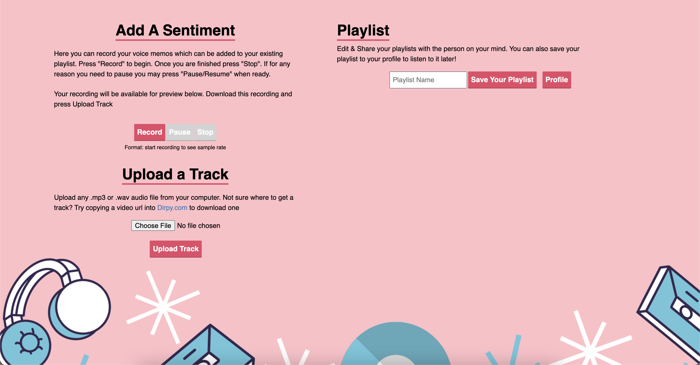

# Sentimixx

**link to project**

### How It’s Made
express framework, nodemon, vs code, passport, mongoose , and faith that I can do anything. 

<b>Langs used</b>
Javascript, HTML5, CSS3, express.js and node.js

### optimizations

I would like to use the soundcloud api to upload tracks and search for audio tracks to include them in a named playlist. taking the upload feature off of the site as it stands would free up more space within the app 

### Lessons Learned
